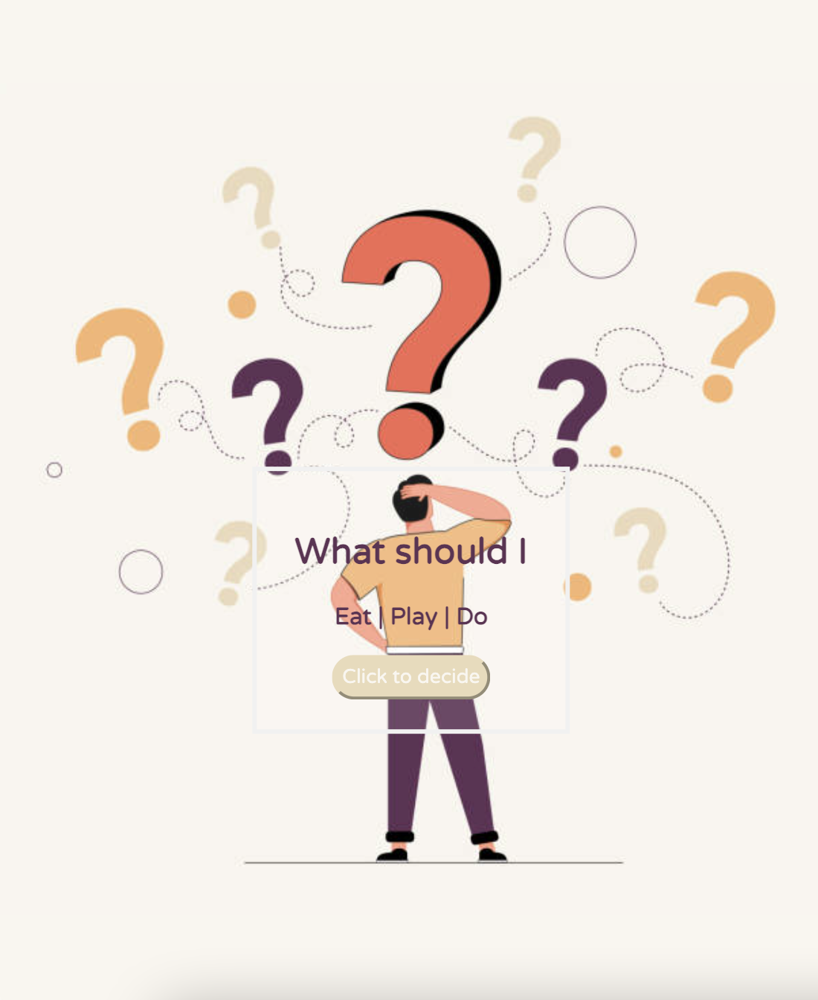

# What Should I

An application that helps you find out what you want to partake in, eat, or even just hang out when you're feeling a little indecisive.

## How to Use

To use this application first click the button on the homepage to enter the app. From there you will receives a list of guidelines that will help you transit through the app. Enter a city then an activity or something you would like to eat in the provided spaces. After you hit submit you will be shown a map of the city you entered, the weather in the area, and information about places that were generated for you.

[Click here](https://e-albert.github.io/What-Should-I/) to enter the application and start choosing what you should do.

